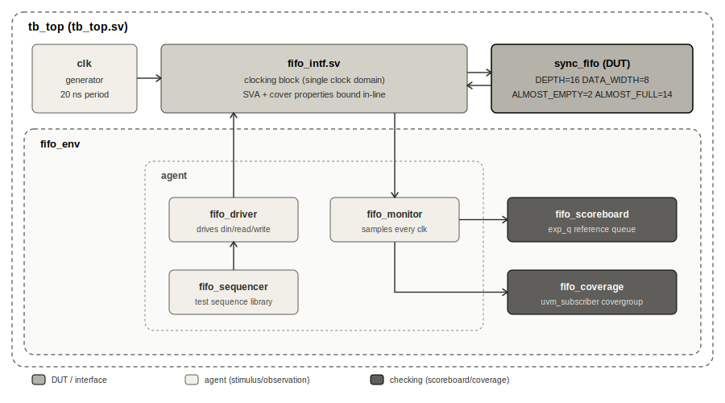

# Verification Plan — Synchronous FIFO (`sync_fifo`)

**DUT:** `sync_fifo.sv` | **Methodology:** UVM

---

## 1. Scope and Objective

This document is the verification plan and as-built summary for the `sync_fifo` UVM environment.

`sync_fifo` is a single-clock-domain FIFO with almost-full/almost-empty flags. There is no clock-domain-crossing hazard by construction, so this plan does not carry CDC-class checks (Gray-code pointer synchronization, metastability, reconvergence). Verification effort here is concentrated on **functional correctness of data flow, flag timing at every occupancy boundary, and reset behavior**.

### 1.1 DUT Parameters

| Parameter | Value | Source |
|---|---|---|
| `DATA_WIDTH` | 8 | `parameters.svh` |
| `DEPTH` | 16 | `parameters.svh` |
| `ALMOST_EMPTY` threshold | 2 | `parameters.svh` |
| `ALMOST_FULL` threshold | 14 (`DEPTH - 2`) | `parameters.svh` |

### 1.2 Risks Targeted

| # | Risk | Mechanism that catches it |
|---|---|---|
| 1 | Data lost, duplicated, or reordered on the write→read path | Scoreboard (§4.1) |
| 2 | `full` / `empty` asserted at the wrong occupancy, or simultaneously | SVA (§4.2) |
| 3 | `alf` / `ale` asserted outside their defined threshold windows | SVA (§4.2) |
| 4 | FIFO does not come out of reset in a known-good state | SVA (§4.2) |
| 5 | Same-cycle read + write mishandled | Coverage cross + directed stimulus (§3, §4.3) |

---

## 2. Environment Architecture

<div align="center">



</div>

```
tb_top (tb_top.sv)
 ├── clk                       single free-running clock, 20 ns period
 ├── sync_fifo (DUT)           DEPTH=16, DATA_WIDTH=8, ALMOST_EMPTY=2, ALMOST_FULL=14
 ├── fifo_intf                 single interface; clocking block + assertions + cover properties
 └── fifo_env
      ├── agent                fifo_sequencer, fifo_driver, fifo_monitor
      ├── fifo_scoreboard       reference-queue checker
      └── fifo_coverage         uvm_subscriber functional coverage
```

**Topology:** single-agent environment. Write and read share one clock, so `fifo_item` carries `read`, `write`, and `din` together, and driver/monitor operate on one clocking block (`fifo_intf.cb`).

**Analysis connections (`fifo_env::connect_phase`):**

| Producer | Consumer(s) |
|---|---|
| `agent.monitor.ap_mon` | `scb.mon_imp`, `coverage.analysis_export` |

**DUT-adjacent checking:** assertions and cover properties for `sync_fifo` are declared directly inside `fifo_intf.sv`, scoped to the interface signals.

**Clocking:** single `clk`, 20 ns period (10 ns half-period). Reset is issued once, at the head of the test, by `reset_seq`.

**Reset polarity:** the `reset` field on `fifo_item` drives the DUT's active-low `i_rstn`. `reset == 0` asserts reset; `reset == 1` is the normal operating state, and every functional sequence (`send_write`, `send_read`, `send_random`) constrains `reset == 1`.

---

## 3. Stimulus

| Test | Sequence(s) | Intent | Default (`run_test`) |
|---|---|---|---|
| `fifo_test` | `reset_seq` → `full_seq` → `drain_seq` → `alf_seq` → `ale_seq` → `rand_seq` | Reset the DUT, drive it to `full`, drain it to `empty`, drive it to `alf`, drain it to `ale`, then apply 50–200 fully randomized read/write/data transactions (`read`/`write` unconstrained per-transaction, so same-cycle read+write occurs naturally in the random phase) | Yes — hardcoded in `tb_top.sv` |

---

## 4. Checking Mechanisms

### 4.1 Scoreboard (`fifo_scoreboard.sv`)

Reference-model queue (`exp_q`), fed by a single analysis port (`mon_imp`):

- **Push:** `write && !full` → `din` enqueued.
- **Pop / compare:** `read && !empty` → dequeue and compare against `dout`; `uvm_error` on mismatch.
- **Underflow guard:** `uvm_error` if a read is observed against an already-empty `exp_q`.

### 4.2 Assertions (`fifo_intf.sv`)

| Assertion | Property |
|---|---|
| `ASSERT_RESET` | `!reset \|-> ##1 (empty && !full)` — FIFO exits reset empty, not full |
| `ASSERT_FULL_EMPTY` | `full` and `empty` are mutually exclusive |
| `ASSERT_ALF_EMPTY` | `alf` never asserted while `empty` |
| `ASSERT_ALE_FULL` | `ale` never asserted while `full` |

### 4.3 Functional Coverage

- **Interface cover properties** (`fifo_intf.sv`): `full` hit, `empty` hit, `alf` hit, `ale` hit, `read && write` (same-cycle) hit.
- **UVM subscriber** (`fifo_coverage.sv`): coverpoints on `reset`, `read`, `write`, `din` (`auto_bin_max=255`), `ale`, `alf`, plus a `read × write` cross.

---

## 5. Sign-off Status

| Item | Status |
|---|---|
| Directed full / empty / almost-full / almost-empty sequences pass via scoreboard | Pass |
| Randomized read/write/data test (`rand_seq`) passes, including same-cycle read+write | Pass |
| Full/empty and almost-flag mutual-exclusion assertions pass | Pass |
| Reset-exit assertion (`empty && !full`) passes | Pass |

---

## 6. Verification Components

| Component | Description |
|---|---|
| Driver | Drives sequence items to the DUT through the virtual interface |
| Monitor | Samples DUT transactions and publishes them through an analysis port |
| Scoreboard | Queue-based reference model for functional checking |
| Coverage | Collects functional coverage on key FIFO operations (interface + UVM subscriber) |
| Sequences | Directed and randomized stimulus generation |
| Assertions | Verify protocol and status flag behavior |